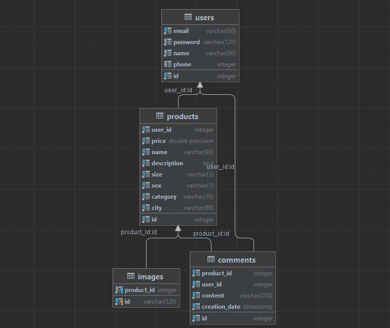

# ModaCheap
Proyecto para el curso Desarrollo Basado en Plataformas (CS2031).

## Integrantes
- Joaquín Francisco Jordán O`Connor 
- Enzo Gabriel Camizan Vidal
- Héctor Valentín Quezada Amour
- José Rafael Chachi Rodriguez

## Descripción del proyecto
Plataforma web en donde se realiza compra y venta de vestimenta de segunda mano para todo género.

## Objetivos principales / Misión / Visión
**Objetivos principales:** 

+ Realizar una exposición web de productos de ropa de segunda mano.
+ Permitir una comunicación entre el vendedor y comprador utilizando el API de WhatsApp.

**Misión:** Lo bueno, bonito y barato al alcance de un click.

**Visión:**  Ser el principal portal web de compra-venta de ropa de segunda mano en Lima.

## Información  acerca de las librerías/frameworks/plugins utilizadas en Front-end, Back-end y Base de datos.

**Front-end:**

Para agilizar el desarrollo front-end se utilizo Bootstrap 5.

Se utilizo Vue.js y Vue Client para nuestra interfaz de usuario y mejor experiencia

**Back-end:**

Para el desarrollo backend se emplearon las siguientes librerias/frameworks:
+ Flask
+ Flask SQLAlchemy
+ Flask Migrate
+ Werkzeug
+ Shortuuid
+ dotenv

**Base de datos:**

Para el desarrollo de la base de datos se utilizo unicamente PostgreSQL en su version 12.9.

## El nombre del script a ejecutar para iniciar la base de datos con datos.

Se debe crear un archivo `.env` en el directorio raiz del proyecto que establezca el valor de la variable `DATABASE_URI` al *URI* de nuestra base de datos local.

## Información acerca de los API. Requests y Responses de cada endpoint utilizado en el sistema.

+ `/register` :
  + POST: 
    + Registra a el usuario con sus atributos, almacena la sesion del usuario y retorna un estado exitoso. Cuando ocurre algun error en el registro, retorna un estado fallido y un mensaje

+ `/login` : 
  * POST
    + Se inicia la sesion del usuario en la aplicacion y retorna una respuesta al cliente el estado de la solicitud (si fue exitosa o no) y un mensaje.

+ `/products` :
  + GET : 
    + Retorna todos los productos.
  + POST : 
    - El usuario puede crear los productos en la aplicacion web, mediante el metodo `POST`, y retorna una respuesta al cliente el estado de la solicitud (si fue exitosa o no) y un mensaje.
+ `/products/<product_id>` :
  + GET : 
    + Retorna el producto con id `product_id`.
  
  + PATCH : 
    + El usuario ya registrado y logeado en la pagina, podra modificar un producto que el haya creado, mediante el metodo `PATCH` y retorna una respuesta al cliente el estado de la solicitud (si fue exitosa o no) y un mensaje.
  
  + DELETE : 
    + El usuario ya registrado y logeado en la pagina, podra eliminar un producto que el haya creado, mediante el metodo `DELETE` y retorna una respuesta al cliente el estado de la solicitud (si fue exitosa o no) y un mensaje.

+ `/users` :
  - PATCH
    + EL usuario puede modificar sus atributos en la aplicacion mediante el metodo `PATCH` y retorna una respuesta al cliente el estado de la solicitud (si fue exitosa o no) y un mensaje.

  - DELETE  
    + El usuario puede eliminar su cuenta de la aplicacion en la pagina, mediante el metodo `DELETE` y retorna una respuesta al cliente el estado de la solicitud (si fue exitosa o no) y un mensaje.

+ `/images` : 
  - GET
    - El usuario puede obtener todas las fotos de los productos de la aplicacion en la pagina, mediante el metodo `GET` y retorna una respuesta al cliente el estado de la solicitud (si fue exitosa o no) y un mensaje.

+ `/products/<product_id>/images`
  - POST:
    - El usuario puede poner o crear las imagenes del producto seleccionado en la aplicacion mediante el metodo `POST` y retorna una respuesta al cliente el estado de la solicitud (si fue exitosa o no) y un mensaje.
+ `/images/<image_id>`
  - DELETE:
    - El usuario puede eliminar o borrar las imagenes del producto seleccionado en la aplicacion mediante el metodo `DELETE` y retorna una respuesta al cliente el estado de la solicitud (si fue exitosa o no) y un mensaje.
  - PATCH:
    - El usuario puede modificar las imagenes del producto seleccionado en la aplicacion mediante el metodo `PATCH` y retorna una respuesta al cliente el estado de la solicitud (si fue exitosa o no) y un mensaje.
+ `/comments` : 
  + GET :
    - El usuario puede ver los comentarios de cada articulo o producto mostrado en la aplicacion web mediante el metodo `GET` y retorna una respuesta al cliente el estado de la solicitud (si fue exitosa o no) y un mensaje.
+ `/comments/<comment_id>`
  + GET :
    - Retorna el comentario, mediante su id con el metodo `GET` y retorna una respuesta al cliente el estado de la solicitud (si fue exitosa o no) y un mensaje.

  + PATCH :
    - El usuario puede modificar cosas en su comentario hecho en una publicacion de un producto mediante el metodo `PATCH` y retorna una respuesta al cliente el estado de la solicitud (si fue exitosa o no) y un mensaje.
  + DELETE :
    - El usuario puede eliminar su comentario hecho en una publicacion de un producto mediante el metodo `DELETE` y retorna una respuesta al cliente el estado de la solicitud (si fue exitosa o no) y un mensaje.
+  `/products/<product_id>/comment`
   +   POST:
        - El usuario puede crear o añadir comentarios en su propio producto o en el de otros mediante el metodo `POST` y retorna una respuesta al cliente el estado de la solicitud (si fue exitosa o no) y un mensaje.  

## Hosts

Para este proyecto se utilizo dos hosts locales
+ El Frontend corre en el puerto 8080, que es el puerto donde esta Vue.js 
+ El Backend corre en el puerto 5000, que es el puerto donde corre Flask  

## Manejo de errores HTTP

Los errores de tipo 400, 401, 404, 405, 422 y 500 mandan una respuesta en formato JSON siguiendo un mismo patron: _success_, _message_ y _status_.

## Cómo ejecutar el sistema (Deployment scripts)

**Backend**

Para usuarios de Windows:

Primero se debe crear el archivo `.env` con los valores de `SECRET_KEY` y `UPLOAD_FOLDER`.

`source venv/bin/activate`

`python app.py`

Para usuarios de Linux:

`./run.sh`

**Frontend**

Para iniciar el frontend, se debe correr el comando `npm run serve`.

## Manejo de test

Para saber que nuestra aplicacion web funciona correctamente, y nuestros endpoints hacen cada rol, y transmiten el mensaje correcto cuando hay un error o no.

+ Para la prueba de los test, se evaluo todos los endpoints con su metodo con sus casos exitosos y los fallidos

+ En cada prueba se verifico el mensaje y el codigo http recibido de los test 

+ Todos los test son satisfactorios y corren de manera correcta verificando la efectividad de los endpoints

Para usuarios de Linux:

`./test.sh`

## Modelo relacional

